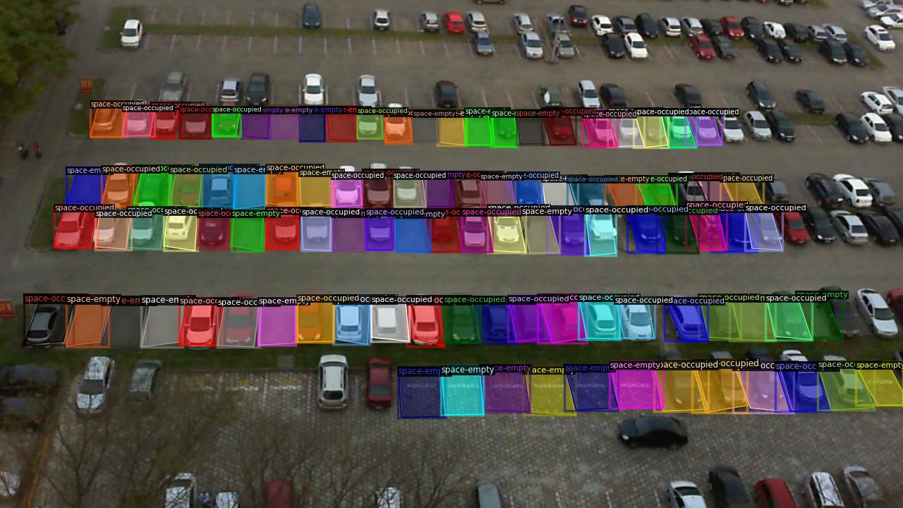
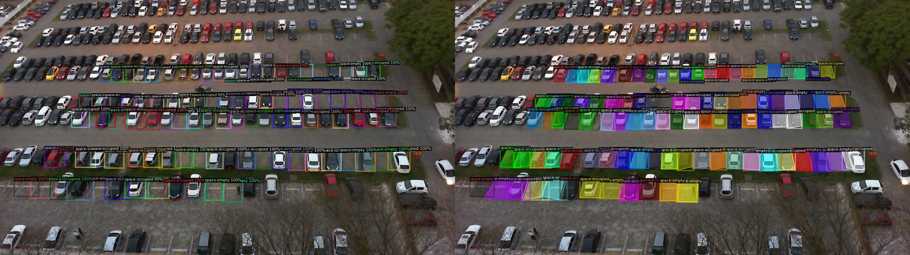

## Faster R-CNN Object Detection

Faster R-CNN is a two-stage detector:
- First, a **Region Proposal Network (RPN)** suggests candidate object regions.
- Second, **Region of Interest (ROI)** heads classify those proposals and refine the bounding boxes.

In **Detectron2**, this pipeline is mature, reproducible, and especially useful when localisation quality matters more than raw throughput.

For this experiment, Faster R-CNN is used to detect parking-space states in a carpark dataset exported in COCO format. This workflow works out a pipeline using Detectron2 for Object Detection

## Carpark dataset

The data can be downloaded from **Roboflow**: https://universe.roboflow.com/tema3/ab-qv8va

Detectron2 works best with **COCO JSON** format with train and validation/test splits. The **COCO JSON** data format is outlined below

```
datasets/
├── train/
│   ├── _annotations.coco.json
│   ├── image001.jpg
│   ├── image002.jpg
│   └── ...
├── valid/
│   ├── _annotations.coco.json
│   ├── image001.jpg
│   ├── image002.jpg
│   └── ...
├── test/
│   ├── _annotations.coco.json
│   ├── image001.jpg
│   ├── image002.jpg
│   └── ...
```

The dataset statistics:

| Split | Images | Total instances | Categories with instances |
|---|---:|---:|---|
| Train | 6000 | 599,602 | `space-empty`, `space-occupied` |
| Valid | 895 | 89,500 | `space-empty`, `space-occupied` |

Although the logs list three category names, one of them is effectively empty:

- `car`: **0 instances** in both training and validation
- `space-empty`: 208,212 train / 51,378 valid
- `space-occupied`: 391,390 train / 38,122 valid

## Detectron2
### Installation
- The following guideline install Detectron2 to HPC environment, same procedure is used to install to local PC:
- First git clone Detectron2 from its original source:

```
git clone https://github.com/facebookresearch/detectron2.git
```

- After creating the conda environment, install Detectron2 inside the repository:

```
python -m pip install -e detectron2
```

- Detectron2 support set of configurations for different models such as faster-rcnn using different base CNN model. They are all available in the config folder:
- For example **faster_rcnn_R_50_C4_3x.yaml** has the meaning:

```
faster_rcnn_R_50_C4_3x
│           │   │  │
│           │   │  └─ 3x training schedule
│           │   └───── C4 backbone feature extraction
│           └───────── ResNet-50
└───────────────────── Faster R-CNN
```

### Set of pre-configuration files
- Detectron2 repo comes with a set of tools that can help to overlay annotation to image to visualize ground-truth data, which can be found in **tools/visualize_data.py**
- In order to visualize the ground-truth data with annotation in **data** folder, we need to prepare several files:

**register_dataset.py**: is used to assign the training/validation/testing image data, also assigning json files for annotation

```
import os

from detectron2.data import DatasetCatalog
from detectron2.data.datasets import register_coco_instances

def register_all_datasets() -> None:
    base_dir = os.path.dirname(os.path.abspath(__file__)+"../")

    datasets = {
        "data_train": (
            os.path.join(base_dir, "datasets", "train", "_annotations.coco.json"),
            os.path.join(base_dir, "datasets", "train"),
        ),
        "data_valid": (
            os.path.join(base_dir, "datasets", "valid", "_annotations.coco.json"),
            os.path.join(base_dir, "datasets", "valid"),
        ),
        "data_test": (
            os.path.join(base_dir, "datasets", "test", "_annotations.coco.json"),
            os.path.join(base_dir, "datasets", "test"),
        ),
    }

    for name, (json_file, image_root) in datasets.items():
        if name in DatasetCatalog.list():
            continue
        register_coco_instances(name, {}, json_file, image_root)
```

**faster_rcnn_carpark.yaml**: is the configuration file to define what model to use, which data to select, number of classes for labels and predefined hyperparameters

```
_BASE_: "./configs/COCO-Detection/faster_rcnn_R_50_FPN_3x.yaml"

DATASETS:
  TRAIN: ("data_train",)
  TEST: ("data_valid",)

DATALOADER:
  NUM_WORKERS: 2

MODEL:
  ROI_HEADS:
    NUM_CLASSES: 2

SOLVER:
  IMS_PER_BATCH: 16
  BASE_LR: 0.0025
  MAX_ITER: 300

OUTPUT_DIR: "./output_faster_rcnn"
```

**visualize_data.py**: the following command is to be inserted to this file in the main function:
```
from register_dataset import register_all_datasets

register_all_datasets()
```

### Entire Detectron2 folder with custom data outline:

```

faster-rcnn-carpark.yaml
configs/
├── Base-RCNN-FPN.yaml
├── COCO-Detection
│   ├── faster_rcnn_R_50_FPN_3x.yaml
│   ├── faster_rcnn_X_101_32x8d_FPN_3x.yaml
│   └── ...
datasets/
├── train/
│   ├── _annotations.coco.json
│   ├── image001.jpg
│   └── ...
├── valid/
│   ├── _annotations.coco.json
│   ├── image001.jpg
│   └── ...
├── test/
│   ├── _annotations.coco.json
│   ├── image001.jpg
│   └── ...
tools/
├── train_net.py
├── register_dataset.py
├── visualize_data.py
├── visualize_json_results.py
│   └── ...
```

### Overlay ground-truth image with annotations
- The following CLI command is used to overlay groundtruth image with annotation:

```
python tools/visualize_data.py \
    --source annotation \
    --config-file faster-rcnn-carpark.yaml \
    --output-dir vis_raw_annotations
```

The corresponding output are generated and images with annotations can be found in output folder:
```
[d2.data.datasets.coco]: Loaded 6000 images in COCO format from ./Object_Detection/Detectron2_carpark/tools/../datasets/train/_annotations.coco.json
  0%|                                                                                                         | 0/6000 [00:00<?, ?it/s]Saving to vis_raw_annotations/2012-09-15_13_02_16_jpg.rf.001625cf3316df444ba05b7e8e81242d.jpg ...
  0%|                                                                                                 | 1/6000 [00:00<40:12,  2.49it/s]Saving to vis_raw_annotations/2012-09-21_12_10_25_jpg.rf.002c8b1d2155b84a22e6dcf856ebb31c.jpg ...
  0%|                                                                                                 | 2/6000 [00:00<38:36,  2.59it/s]Saving to vis_raw_annotations/2012-10-11_07_58_58_jpg.rf.0043c1bba18eaa177a8e9bb0b8c39166.jpg ...
  0%|     
```

A quick visualization for trained image with annotation:



Note: we could see that not all occupied and vacant spots are annotated, that may result to the model training and validation

### Faster-RCNN Model Training
- Using the same yaml file *faster-rcnn-carpark.yaml*
- We just need to modify the **train_net.py** similar to **visualize_data.py** to insert in the main function:
```
from register_dataset import register_all_datasets

register_all_datasets()
```

- The command to train the faster-rcnn model for carpark and save the output to log files:

```
python tools/train_net.py --config-file faster-rcnn-carpark.yaml > train_faster_rcnn.log
```

The trained weights are saved as:

```
./output_faster_rcnn/model_final.pth
```

### Model Validation

Validation was run in evaluation-only mode using the final checkpoint, the output is also saved to log file:

```
python tools/train_net.py --config-file faster-rcnn-carpark.yaml --eval-only MODEL.WEIGHTS ./output_faster_rcnn/model_final.pth > eval_faster_rcnn.log
```

The Faster R-CNN model was trained using the Detectron2 implementation of the **`faster_rcnn_R_50_FPN_3x`** architecture, which combines a **ResNet-50 backbone** with a **Feature Pyramid Network (FPN)** for multi-scale object detection. The model was configured to detect two parking-space classes: **space-empty** and **space-occupied**. Training and validation datasets were registered as `data_train` and `data_valid`, respectively.

Training was performed on a single **NVIDIA A100-SXM4 80GB GPU** using **PyTorch 2.5.1**, **CUDA 12.4**, and **Detectron2 0.6**. The configuration used a batch size of **16 images per iteration**, a base learning rate of **0.0025**, and a maximum training duration of **1,000 iterations**. Data augmentation consisted primarily of random horizontal flipping and multi-scale image resizing between 640 and 800 pixels on the shorter side.

The validation results demonstrate strong object detection performance:


| Metric | Value |
|----------|--------:|
| AP (IoU=0.50:0.95) | **77.45%** |
| AP50 | **89.30%** |
| AP75 | **89.23%** |
| AR@100 | **86.20%** |
| AP (Space Empty) | **78.54%** |
| AP (Space Occupied) | **76.36%** |


The final Faster R-CNN model achieved strong validation performance on the car park dataset, obtaining an overall **Average Precision (AP) of 77.45%**. The high **AP50 (89.30%)** and **AP75 (89.23%)** scores indicate excellent object localization accuracy across different IoU thresholds. Class-level results show balanced detection performance for both parking-space categories, with **78.54% AP** for **space-empty** and **76.36% AP** for **space-occupied**. The model also achieved an **Average Recall (AR@100) of 86.20%**, demonstrating its ability to identify the majority of parking spaces in the validation dataset. Overall, these results suggest that the trained Faster R-CNN model is highly effective for parking occupancy detection and is suitable for deployment in real-world car park monitoring applications., achieving an overall **AP of 77.45%**, with **AP50 of 89.30%** and **AP75 of 89.23%**. These metrics indicate that the model is not only capable of detecting parking spaces accurately but is also highly precise in localizing them, as evidenced by the nearly identical AP50 and AP75 scores. 
The model achieved an **Average Recall (AR@100) of 86.2%**, suggesting that the majority of parking spaces in the validation set were successfully identified.
Class-level analysis shows balanced performance between the two primary classes, with **space-empty achieving 78.54% AP** and **space-occupied achieving 76.36% AP**, demonstrating the model’s ability to reliably distinguish between available and occupied parking spaces. 

Overall, the final Faster R-CNN model exhibits robust and production-ready performance for parking occupancy detection, with validation results indicating a high degree of reliability across the target classes.

### Visualize the validation output

Similarly, **visualize_json_results.py**: the following command is to be inserted to this file in the main function for visualizing the validation model output:
```
from register_dataset import register_all_datasets

register_all_datasets()
```

The CLI command is as below

```
python tools/visualize_json_results.py \
    --input output_faster_rcnn/inference/coco_instances_results.json \
    --output vis_valid_results \
    --dataset data_valid
```

We finally have all annotated output images in validation folder:




## Conclusions
### Conclusion and Future Work

The final Faster R-CNN model achieved promising results on the car park dataset, obtaining an overall AP of 77.45% and demonstrating balanced detection performance for both empty and occupied parking spaces. These results indicate that the model successfully learned the visual characteristics required for parking occupancy detection and can serve as a strong baseline for automated parking monitoring applications.

Despite the encouraging performance, several limitations were observed during the study. A manual review of the dataset revealed that a number of training and validation images were either partially annotated or contained missing parking-space annotations. Such inconsistencies can negatively affect model learning because unannotated objects may be treated as background during training, reducing the detector's ability to generalize to all parking scenarios. In addition, variations in lighting conditions, viewing angles, shadows, and vehicle occlusions introduce challenges that are not fully represented in the current dataset.

Future work will focus on improving annotation quality and dataset completeness by performing a comprehensive review of both training and validation images. Expanding the dataset with additional samples covering different weather conditions, camera perspectives, and parking lot layouts is also expected to improve model robustness. Furthermore, experimenting with longer training schedules, advanced data augmentation techniques, and newer object detection architectures may further enhance detection accuracy and generalization performance in real-world deployments.
