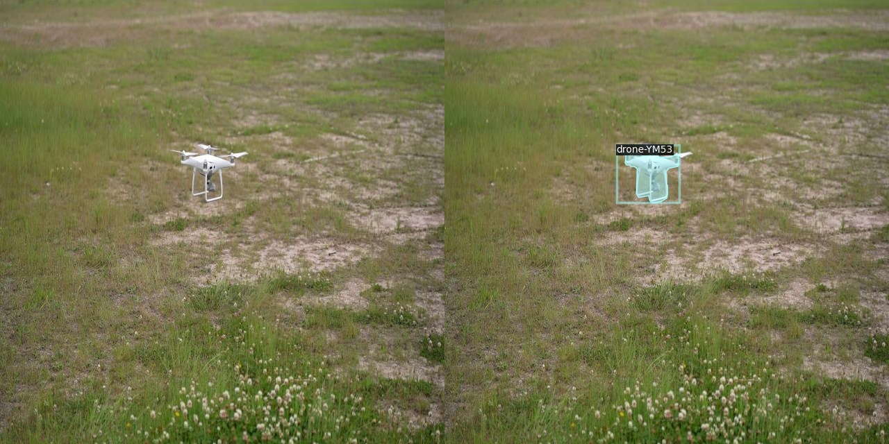

## Mask R-CNN Instance Segmentation

**Mask R-CNN** extends the two-stage **Faster R-CNN** object detection architecture with pixel-level instance segmentation capabilities. While Faster R-CNN performs object detection through two stages:
- First, a **Region Proposal Network (RPN)** suggests candidate object regions.
- Second, **Region of Interest (ROI)** heads classify those proposals and refine bounding boxes.

Mask R-CNN adds a parallel branch that generates precise pixel-level masks for each detected instance, enabling not just localization but also segmentation. This extension makes Mask R-CNN ideal for tasks requiring detailed object boundaries, such as instance segmentation in aerial imagery.

In **Detectron2**, this mature pipeline provides reproducible, high-quality results that prioritize segmentation accuracy. For this experiment, Mask R-CNN is used to perform instance segmentation on a drone dataset exported in COCO format, creating a robust pipeline for precise object boundary detection and classification.

## Drone dataset

The data can be downloaded from **Roboflow**: 
Detectron2 works best with **COCO JSON** format with train and validation/test splits. The **COCO JSON** data format is outlined below

```
datasets/
├── train/ # 1424 images
│   ├── _annotations.coco.json
│   ├── image001.jpg
│   ├── image002.jpg
│   └── ...
├── valid/ # 407 images
│   ├── _annotations.coco.json
│   ├── image001.jpg
│   ├── image002.jpg
│   └── ...
├── test/ #203 images
│   ├── _annotations.coco.json
│   ├── image001.jpg
│   ├── image002.jpg
│   └── ...
```

## Detectron2

**Detectron2** is an open-source computer vision library developed by Meta AI (Facebook Research). It provides a unified framework for training and deploying state-of-the-art models on tasks such as object detection, instance segmentation, and semantic segmentation. For image segmentation, Detectron2 is especially well suited to **instance segmentation**, where the goal is to detect each object in an image and assign a pixel-level mask to every instance separately.

Unlike semantic segmentation, which labels every pixel with a class but does not distinguish between individual objects, instance segmentation answers both *what* is present and *where each object is*. Detectron2 implements this through architectures such as **Mask R-CNN**, which extends object detection with a mask prediction branch for each detected instance. The library ships with pre-trained models, standardized COCO-format data loaders, and YAML-based configuration files, making it straightforward to adapt a segmentation pipeline to custom datasets—such as drone imagery—without rebuilding the training loop from scratch.

### Installation
- The following guideline install Detectron2 to HPC environment, same procedure is used to install to local PC:
- First git clone Detectron2 from its original source:

```
git clone https://github.com/facebookresearch/detectron2.git
```

- After creating the conda environment, install Detectron2 inside the repository:

```
python -m pip install -e detectron2
```

- Detectron2 support set of configurations for different models such as mask-rcnn using different base CNN model. They are all available in the config folder:
- For example **mask_rcnn_R_50_FPN_3x.yaml** has the meaning:

```
mask_rcnn_R_50_FPN_3x
│           │   │  │
│           │   │  └─ 3x training schedule
│           │   └───── Feature Pyramid Network
│           └───────── ResNet-50
└───────────────────── Mask R-CNN
```

### Set of pre-configuration files
- Detectron2 repo comes with a set of tools that can help to overlay annotation to image to visualize ground-truth data, which can be found in **tools/visualize_data.py**
- In order to visualize the ground-truth data with annotation in **data** folder, we need to prepare several files:

**register_dataset.py**: is used to assign the training/validation/testing image data, also assigning json files for annotation

```
import os

from detectron2.data import DatasetCatalog
from detectron2.data.datasets import register_coco_instances

def register_all_datasets() -> None:
    base_dir = os.path.dirname(os.path.abspath(__file__)+"../")

    datasets = {
        "data_train": (
            os.path.join(base_dir, "datasets", "train", "_annotations.coco.json"),
            os.path.join(base_dir, "datasets", "train"),
        ),
        "data_valid": (
            os.path.join(base_dir, "datasets", "valid", "_annotations.coco.json"),
            os.path.join(base_dir, "datasets", "valid"),
        ),
        "data_test": (
            os.path.join(base_dir, "datasets", "test", "_annotations.coco.json"),
            os.path.join(base_dir, "datasets", "test"),
        ),
    }

    for name, (json_file, image_root) in datasets.items():
        if name in DatasetCatalog.list():
            continue
        register_coco_instances(name, {}, json_file, image_root)
```

**mask_rcnn_drone.yaml**: is the configuration file to define what model to use, which data to select, number of classes for labels and predefined hyperparameters

```
_BASE_: "./configs/COCO-InstanceSegmentation/mask_rcnn_R_50_FPN_3x.yaml"

DATASETS:
  TRAIN: ("data_train",)
  TEST: ("data_valid",)

DATALOADER:
  NUM_WORKERS: 2

MODEL:
  ROI_HEADS:
    NUM_CLASSES: 2

SOLVER:
  IMS_PER_BATCH: 16
  BASE_LR: 0.0025
  MAX_ITER: 300

OUTPUT_DIR: "./output_mask_rcnn"
```

**visualize_data.py**: the following command is to be inserted to this file in the main function:
```
from register_dataset import register_all_datasets

register_all_datasets()
```

### Entire Detectron2 folder with custom data outline:

```

mask-rcnn-drone.yaml
configs/
├── Base-RCNN-FPN.yaml
├── COCO-InstanceSegmentation
│   ├── mask_rcnn_R_50_FPN_3x.yaml
│   ├── mask_rcnn_R_101_DC5_3x.yaml
│   └── ...
datasets/
├── train/
│   ├── _annotations.coco.json
│   ├── image001.jpg
│   └── ...
├── valid/
│   ├── _annotations.coco.json
│   ├── image001.jpg
│   └── ...
├── test/
│   ├── _annotations.coco.json
│   ├── image001.jpg
│   └── ...
tools/
├── train_net.py
├── register_dataset.py
├── visualize_data.py
├── visualize_json_results.py
│   └── ...
```

### Overlay ground-truth image with annotations
- The following CLI command is used to overlay groundtruth image with annotation:

```
python tools/visualize_data.py \
    --source annotation \
    --config-file mask-rcnn-drone.yaml \
    --output-dir vis_raw_annotations
```

The corresponding output are generated and images with annotations can be found in output folder:
```
Loaded 1424 images in COCO format from /work/projects/tuev/tuev_work/tuev_work/Project/Image_Segmentation/Detectron2_MaskRCNN_Drone/tools/../datasets/train/_annotations.coco.json
  0%|                                                                    | 0/1424 [00:00<?, ?it/s]Saving to vis_raw_annotations/C0012-01414_png.rf.3038649e44a38d191c052f068202f20c.jpg ...
  0%|                                                            | 1/1424 [00:00<03:38,  6.52it/s]Saving to vis_raw_annotations/C0012-01517_png.rf.ec71f5e43bd69f0ceebfca2d21c52bda.jpg ...
Saving to vis_raw_annotations/C0012-00332_png.rf.5c3ff5e8e43d6cfddb21de56388a27c8.jpg ...
  0%|▏                                                           | 3/1424 [00:00<02:04, 11.38it/s   
```

A quick visualization for trained image with annotation:


### Mask-RCNN Model Training
- Using the same yaml file *mask-rcnn-drone.yaml*
- We just need to modify the **train_net.py** similar to **visualize_data.py** to insert in the main function:
```
from register_dataset import register_all_datasets

register_all_datasets()
```

- The command to train the mask-rcnn model for drone and save the output to log files:

```
python tools/train_net.py --config-file mask-rcnn-drone.yaml > train_mask_rcnn.log
```

The trained weights are saved as:

```
./output_mask_rcnn/model_final.pth
```

### Model Validation

Validation was run in evaluation-only mode using the final checkpoint, the output is also saved to log file:

```
python tools/train_net.py --config-file mask-rcnn-drone.yaml --eval-only MODEL.WEIGHTS ./output_mask_rcnn/model_final.pth > eval_mask_rcnn.log
```

The Mask R-CNN model was trained using the Detectron2 **`mask_rcnn_R_50_FPN_3x`** architecture (ResNet-50 + FPN). Training ran for **3,000 iterations** (~26 minutes on an A100 GPU) with batch size 16 and learning rate 0.0025. Validation AP was computed on the **407-image** `data_valid` split after training (`train_mask_rcnn_drone.log`) and confirmed in a separate eval-only run (`eval_mask_rcnn_drone.log`). Both logs report identical results.

### Training and Validation AP

| Task | AP | AP50 | AP75 | AP (small) | AP (medium) |
|---|---:|---:|---:|---:|---:|
| **Bounding box** | **81.56%** | 98.02% | 97.92% | 78.23% | 83.71% |
| **Segmentation** | **73.63%** | 98.02% | 98.01% | 71.23% | 75.78% |

**Per-class AP (`drone-YM53`):** bbox **81.56%**, segm **73.63%**.

Bounding-box detection outperforms instance segmentation on overall AP (81.6% vs 73.6%), but both tasks achieve **AP50 and AP75 above 98%**, indicating reliable drone detection and precise mask boundaries on the validation set. Compared with the earlier 300-iteration run (segm AP ~69.6%, bbox AP ~71.7%), extending training to **3,000 iterations** improved segm AP by roughly **4 points** and bbox AP by roughly **10 points**. Training loss fell from **1.75** (iter 19) to **0.19** (iter 2999), consistent with the AP gains.


### Visualize the validation output

Similarly, **visualize_json_results.py**: the following command is to be inserted to this file in the main function for visualizing the validation model output:
```
from register_dataset import register_all_datasets

register_all_datasets()
```

The CLI command is as below

```
python tools/visualize_json_results.py \
    --input output_mask_rcnn/inference/coco_instances_results.json \
    --output vis_valid_results \
    --dataset data_valid
```

We finally have all annotated output images in validation folder:




## Conclusions
### Conclusion and Future Work

The Mask R-CNN model achieved **73.6% segmentation AP** and **81.6% bounding-box AP** on the validation set after 3,000 training iterations. AP50 and AP75 both exceed **98%** for detection and segmentation, showing that the model reliably finds drones and produces accurate masks in aerial imagery.

Future work can push toward the full 3× COCO schedule, evaluate on the held-out test split, and explore deeper backbones or stronger augmentation for further AP gains.
