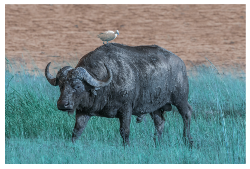
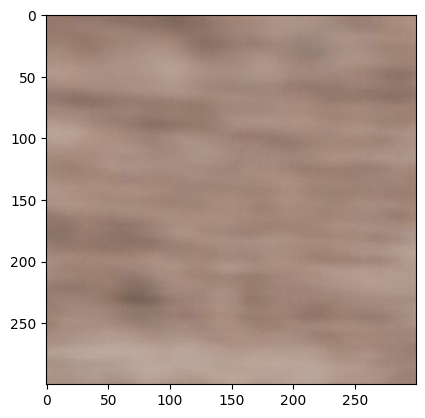
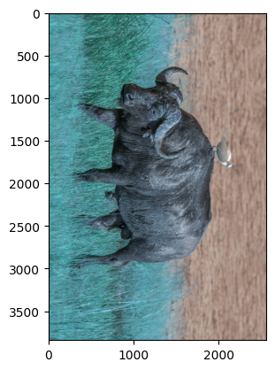
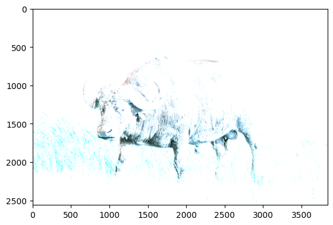
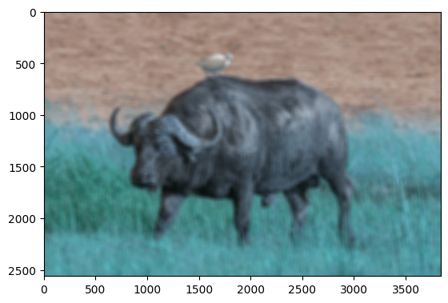
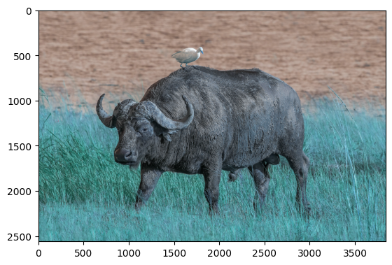

## Introduction to OpenCV
### Read, Display and Save image
- Install opencv to your env:
```
pip install opencv-python
```
- Import opencv

```python
import cv2
print(cv2.__version__)
```
    4.13.0
- Use **cv2.imread** to read an image

```python
img1 = cv2.imread('./Img/African_buffalo.jpg')
```

```python
print("Shape of image is ",img1.shape)
print("Max value of image is ",img1.max())
print("Min value of image is ",img1.min())
```
    Shape of image is  (2560, 3840, 3)
    Max value of image is  255
    Min value of image is  0
- **cv2.imshow** function can be used to load an image from CLI, with native GUI. 
- In Jupyter Notebook env, cv2.imshow will not work so we can preview the image using matplotlib.imshow

```python
import matplotlib.pyplot as plt
plt.imshow(img1)
plt.axis('off')
plt.show()
```



- Save img to another image using **cv2.imwrite**

```python
cv2.imwrite("./Img/African_buffalo_copy.jpg", img1)
```
    True
### Upscale and Downscale image
- The function **cv2.resize()** is used to resize an image. It takes the following parameters:
  - **src**: The source image.
  - **dsize**: The desired size of the output image. It is a tuple (width, height).
  - **fx**: The scale factor along the horizontal axis. If it is 0, it is calculated as (dsize.width / src.width).
  - **fy**: The scale factor along the vertical axis. If it is 0, it is calculated as (dsize.height / src.height).
  - **interpolation**: The interpolation method to be used. It can be one of the following:
    - **cv2.INTER_NEAREST**: Nearest neighbor interpolation.
    - **cv2.INTER_LINEAR**: Bilinear interpolation (default).
    - **cv2.INTER_AREA**: Resampling using pixel area relation. It may be a preferred method for image decimation, as it gives moire'-free results. But when the image is zoomed, it is similar to the INTER_NEAREST method.
    - **cv2.INTER_CUBIC**: Bicubic interpolation over 4x4 pixel neighborhood.
    - **cv2.INTER_LANCZOS4**: Lanczos interpolation over 8x8 pixel neighborhood.    


```python
img1_downsize = cv2.resize(img1, (img1.shape[1]//2, img1.shape[0]//2),interpolation=cv2.INTER_LINEAR)
print("Shape of downsize image is ",img1_downsize.shape)

```
    Shape of downsize image is  (1280, 1920, 3)

```python
img1_upsize = cv2.resize(img1, (img1.shape[1]*2, img1.shape[0]*2),interpolation=cv2.INTER_CUBIC)
print("Shape of upsize image is ",img1_upsize.shape)
```
    Shape of upsize image is  (5120, 7680, 3)
### Cropping image
- Using sliding window to crop the image

```python
img1_cropped = img1[100:400, 100:400]
print("Shape of cropped image is ",img1_cropped.shape)
plt.imshow(img1_cropped)
```
    Shape of cropped image is  (300, 300, 3)


### Image translation and rotation
Some popular function:
- cv2.ROTATE_90_CLOCKWISE
- cv2.getRotationMatrix2D
- cv2.warpAffine

```python
img1_rotated = cv2.rotate(img1, cv2.ROTATE_90_CLOCKWISE)
plt.imshow(img1_rotated)
```



### Convolution
- In Computer Science, convolution is a mathematical operation that combines two functions to produce a third function. In the context of image processing, convolution is used to apply filters to images, which can enhance certain features or reduce noise. The process involves sliding a kernel (a small matrix) over the image and performing element-wise multiplication and summation to produce a new pixel value in the output image. This technique is fundamental in various applications such as edge detection, blurring, and sharpening of images.
- In OpenCV, we can apply function **cv2.filter2D** to apply convolution to an image
- The example below is to apply a *blur kernel* to existing image


```python
import numpy as np
kernel_blur = np.ones((5,5),np.float32)/5
img_blur = cv2.filter2D(img1, ddepth=-1, kernel=kernel_blur)
plt.imshow(img_blur)
```


- We can also use **cv2.blur** instead of **cv2.filter2D**

```python
img_blur2 = cv2.blur(img1, ksize=(50,50))
plt.imshow(img_blur2)
```

    
- Alternatively, we can apply *sharp* kernel to original image:

```python
kernel_sharp = np.array([[0, -1,  0],
                         [-1,  5, -1],
                         [0, -1,  0]])
img_sharp = cv2.filter2D(img1, ddepth=-1, kernel=kernel_sharp)
plt.imshow(img_sharp)
```

