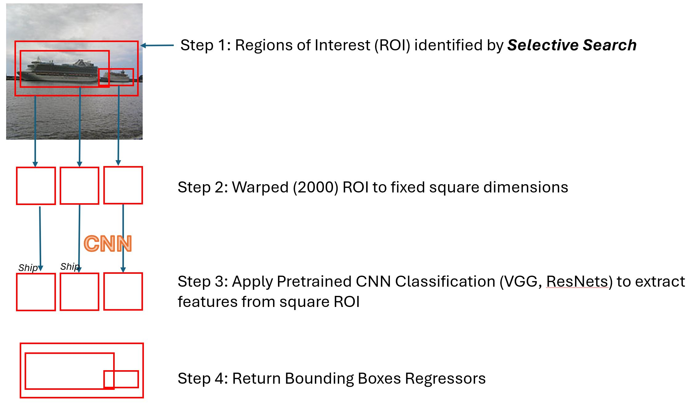
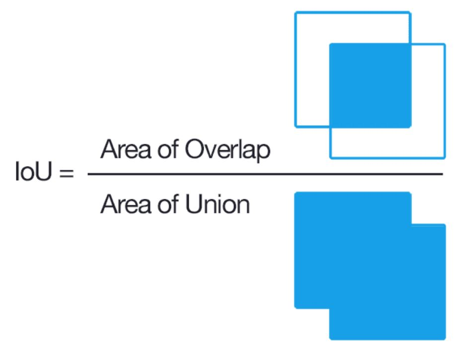
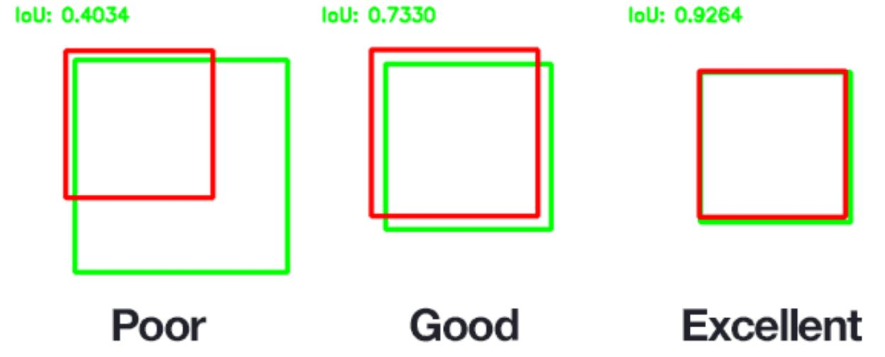
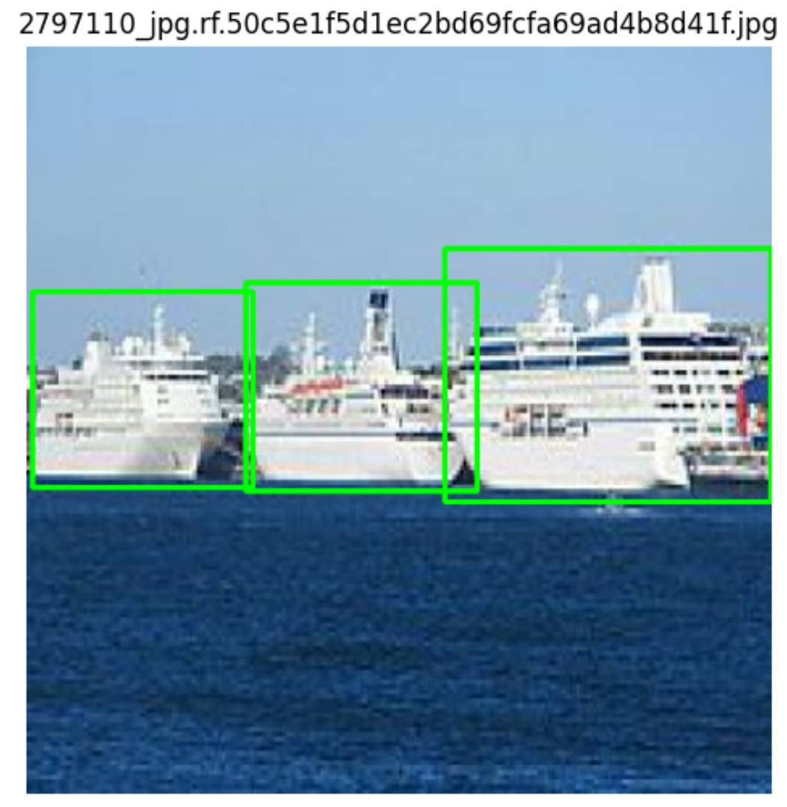
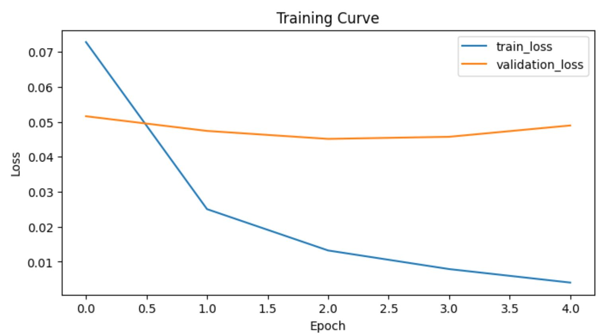
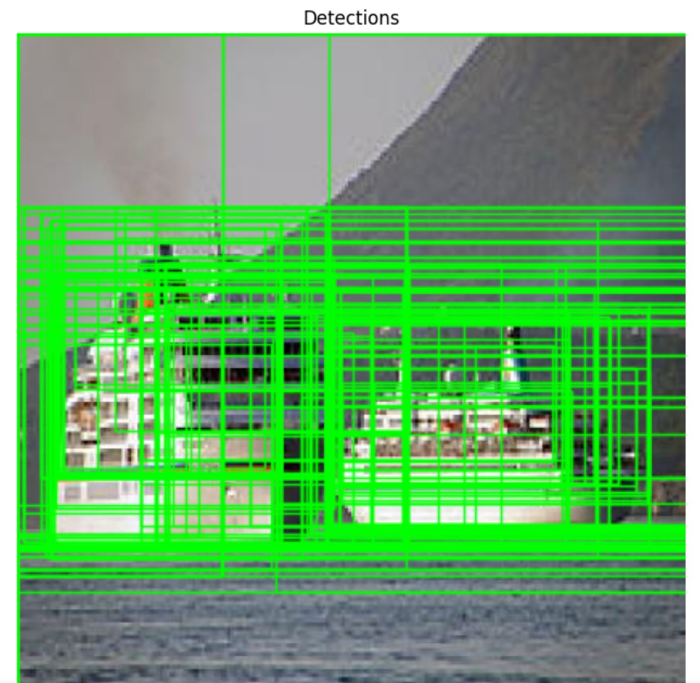
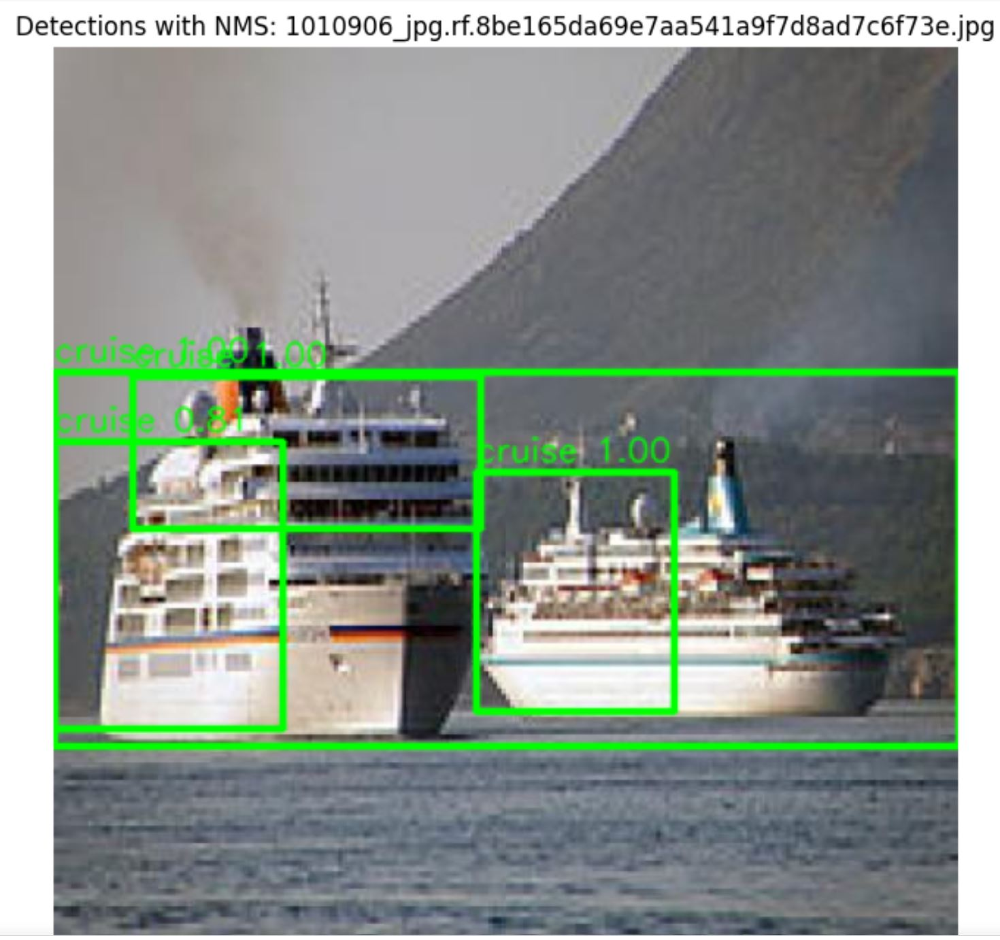

RCNN workflow using **PyTorch + torchvision**.

#### Pipeline:
1. Load images and annotation boxes
2. Generate region proposals with Selective Search
3. Build positive/negative proposal crops
4. Train a binary classifier (`cruise` vs `not cruise`) using VGG16 backbone
5. Run inference on a full image using proposals

### RCNN Components:
RCNN consists of 4 main components:
- Regional Proposal: extraction region of interest using selective search, which is a greedy algorithm proposed by Uijlings et al. (2012), creating max_proposal number of rectangle covering region of interest (ROI)
- Feature Extraction: using backbone CNN Classification models such as VGGs, ResNets to extract feature from each ROI
- Classification Head: R-CNN makes use of Neural Network classifier to identify the class of objects in ROI
- Regression Head: localization aspect of object detection task using 4 coordinates (x,y, width, height)



- We install conda env with cuda version 12.8 and torch version 2.9.1


```python
import os
import cv2
import numpy as np
import pandas as pd
import matplotlib.pyplot as plt
import xml.etree.ElementTree as ET

import torch
import torch.nn as nn
import torch.optim as optim
from torch.utils.data import Dataset, DataLoader

from torchvision import models, transforms
from torchvision.ops import nms

print('torch:', torch.__version__)
print('cuda available:', torch.cuda.is_available())
```

    torch: 2.9.1+cu128
    cuda available: True


### Data
- The object detection data we are using in this project is [Cruise Detection](https://universe.roboflow.com/yolo-project/cruise/dataset/2)
- In this, we download zip file in Pascal VOC XML format which have separate train, test and validation data
- For each data, there are image and corresponding annotation folder with xml format to represent the groundtruth bounding box
- The 3 folders are downloaded and unzip to the same folder as this notebook

We preset some hyperparameter for the model such as:
- IMG_SIZE = 224, the size of all images to be resize before feeding to NN for VGG model
- Max_Proposal=2000, which is the max number bounding box (region of interest, ROI) created from Selective Search in step 1
- IOU: Intersection Over Union
- POS_PER_IMAGE: Number of positive samples selected from each images. Positive sample is a proposal that overlaps a real object
- NEG_PER_IMAGE: Number of negative samples per image. Negative sample represents background regions that do not correspond with target object
- POS_IOU: threshold for labelling a proposal as positive
- NEG_IOU: threshold for labelling a proposal as negative


```python
train_img_path = 'train/image'
train_annot_path = 'train/annotation'
test_img_path = 'test/image'
test_annot_path = 'test/annotation'
valid_img_path = 'valid/image'
valid_annot_path = 'valid/annotation'


IMG_SIZE = 224
MAX_PROPOSALS = 2000
POS_PER_IMAGE = 30
NEG_PER_IMAGE = 30
POS_IOU = 0.7
NEG_IOU = 0.3

device = torch.device('cuda' if torch.cuda.is_available() else 'cpu')
print('device:', device)
```

    device: cuda


#### IOU: Intersection Over Union
- IOU is used to evaluate the performance of object detection by comparing ground truth bounding box to predicted one.

- A good IOU value is 0.75 as seen below:

- The function `get_iou` below calculate the iou value between 2 bounding boxes: ground truth and prediction


```python
def get_iou(bb1, bb2):
    x_left = max(bb1['x1'], bb2['x1'])
    y_top = max(bb1['y1'], bb2['y1'])
    x_right = min(bb1['x2'], bb2['x2'])
    y_bottom = min(bb1['y2'], bb2['y2'])

    if x_right <= x_left or y_bottom <= y_top:
        return 0.0

    intersection = (x_right - x_left) * (y_bottom - y_top)
    area1 = (bb1['x2'] - bb1['x1']) * (bb1['y2'] - bb1['y1'])
    area2 = (bb2['x2'] - bb2['x1']) * (bb2['y2'] - bb2['y1'])
    return intersection / float(area1 + area2 - intersection + 1e-8)


```

- The function `read_gt_boxes` converts annotation in xml format to ground truth boxes and overlay onto corresponding image


```python

def read_gt_boxes(annotation_xml_path, target_class=None):
    tree = ET.parse(annotation_xml_path)
    root = tree.getroot()

    gt_boxes = []
    for obj in root.findall('object'):
        cls_name = obj.findtext('name', default='').strip().lower()
        if target_class is not None and cls_name != target_class.lower():
            continue

        bnd = obj.find('bndbox')
        if bnd is None:
            continue

        x1 = int(float(bnd.findtext('xmin', default='0')))
        y1 = int(float(bnd.findtext('ymin', default='0')))
        x2 = int(float(bnd.findtext('xmax', default='0')))
        y2 = int(float(bnd.findtext('ymax', default='0')))

        if x2 <= x1 or y2 <= y1:
            continue

        gt_boxes.append({'x1': x1, 'y1': y1, 'x2': x2, 'y2': y2})

    return gt_boxes
```

Visualize one example image with GT boxes


```python
# Visualize one example image with GT boxes
for i, ann_file in enumerate(os.listdir(train_annot_path)):
    if not ann_file.endswith('.xml'):
        continue
    
    img_file = ann_file.split('.xml')[0] + '.jpg'    
    img_path = os.path.join(train_img_path, img_file)
    ann_path = os.path.join(train_annot_path, ann_file)

    img = cv2.imread(img_path)
    if img is None:
        continue

    boxes = read_gt_boxes(ann_path)
    vis = img.copy()
    for b in boxes:
        cv2.rectangle(vis, (b['x1'], b['y1']), (b['x2'], b['y2']), (0, 255, 0), 2)

    plt.figure(figsize=(6, 6))
    plt.title(img_file)
    plt.imshow(cv2.cvtColor(vis, cv2.COLOR_BGR2RGB))
    plt.axis('off')
    break
```


    

    


- We initiate `Selective Search` from OpenCV to calculate the number of bounding boxes


```python
if not hasattr(cv2, 'ximgproc'):
    raise ImportError('OpenCV ximgproc is required. Install opencv-contrib-python.')

ss = cv2.ximgproc.segmentation.createSelectiveSearchSegmentation()
print('Selective Search is ready.')
```

    Selective Search is ready.


#### Build Training data from inputs images and annotation (labels)


```python
def build_training_data(train_image_dir, train_annot_dir, max_images=None, target_class='cruise'):
    train_images = []
    train_labels = []

    ann_files = [f for f in os.listdir(train_annot_dir) if f.endswith('.xml')]
    ann_files.sort()
    if max_images is not None:
        ann_files = ann_files[:max_images]

    for idx, ann_file in enumerate(ann_files):
        img_file = ann_file.split('.xml')[0] + '.jpg'
        img_path = os.path.join(train_image_dir, img_file)
        ann_path = os.path.join(train_annot_dir, ann_file)

        image = cv2.imread(img_path)
        if image is None:
            continue

        gt_boxes = read_gt_boxes(ann_path, target_class=target_class)
        if len(gt_boxes) == 0:
            continue

        ss.setBaseImage(image)
        ss.switchToSelectiveSearchFast()
        proposals = ss.process()

        pos_count = 0
        neg_count = 0

        for p_idx, (x, y, w, h) in enumerate(proposals):
            if p_idx >= MAX_PROPOSALS:
                break

            if w <= 0 or h <= 0:
                continue

            candidate = {'x1': x, 'y1': y, 'x2': x + w, 'y2': y + h}
            best_iou = 0.0
            for gt in gt_boxes:
                best_iou = max(best_iou, get_iou(gt, candidate))

            crop = image[y:y+h, x:x+w]
            if crop.size == 0:
                continue

            crop = cv2.resize(crop, (IMG_SIZE, IMG_SIZE), interpolation=cv2.INTER_AREA)

            if best_iou >= POS_IOU and pos_count < POS_PER_IMAGE:
                train_images.append(crop)
                train_labels.append(1)
                pos_count += 1
            elif best_iou <= NEG_IOU and neg_count < NEG_PER_IMAGE:
                train_images.append(crop)
                train_labels.append(0)
                neg_count += 1

            if pos_count >= POS_PER_IMAGE and neg_count >= NEG_PER_IMAGE:
                break

        if (idx + 1) % 20 == 0:
            print(f'Processed {idx + 1}/{len(ann_files)} annotations')

    return np.array(train_images), np.array(train_labels)
```

#### Build a model with a binary Classification head: Cruise vs Not Cruise


```python
TARGET_CLASS = 'cruise'
X_train, y_train = build_training_data(
    train_img_path,
    train_annot_path,
    target_class=TARGET_CLASS,
)
print('X_train:', X_train.shape)
print('y_train:', y_train.shape)
print('class balance:', np.bincount(y_train) if len(y_train) > 0 else 'empty')
```

    Processed 20/541 annotations
    Processed 40/541 annotations
    Processed 60/541 annotations
    Processed 80/541 annotations
    Processed 100/541 annotations
    Processed 120/541 annotations
    Processed 140/541 annotations
    Processed 160/541 annotations
    Processed 180/541 annotations
    Processed 200/541 annotations
    Processed 220/541 annotations
    Processed 240/541 annotations
    Processed 260/541 annotations
    Processed 280/541 annotations
    Processed 300/541 annotations
    Processed 320/541 annotations
    Processed 340/541 annotations
    Processed 360/541 annotations
    Processed 380/541 annotations
    Processed 400/541 annotations
    Processed 420/541 annotations
    Processed 440/541 annotations
    Processed 460/541 annotations
    Processed 480/541 annotations
    Processed 500/541 annotations
    Processed 520/541 annotations
    Processed 540/541 annotations
    X_train: (21730, 224, 224, 3)
    y_train: (21730,)
    class balance: [16230  5500]


```python
TARGET_CLASS = 'cruise'
X_valid, y_valid = build_training_data(
    valid_img_path,
    valid_annot_path,
    target_class=TARGET_CLASS,
)
print('X_valid:', X_valid.shape)
print('y_valid:', y_valid.shape)
print('class balance:', np.bincount(y_valid) if len(y_valid) > 0 else 'empty')
```

    Processed 20/159 annotations
    Processed 40/159 annotations
    Processed 60/159 annotations
    Processed 80/159 annotations
    Processed 100/159 annotations
    Processed 120/159 annotations
    Processed 140/159 annotations
    X_valid: (6472, 224, 224, 3)
    y_valid: (6472,)
    class balance: [4770 1702]


- We apply Image Augmentation to generalize the data that include flipping horizontally, rotation


```python

train_transform = transforms.Compose([
    transforms.ToPILImage(),
    transforms.RandomHorizontalFlip(),
    transforms.RandomRotation(10),
    transforms.ToTensor(),
    transforms.Normalize([0.485, 0.456, 0.406], [0.229, 0.224, 0.225]),
])

valid_transform = transforms.Compose([
    transforms.ToPILImage(),
    transforms.ToTensor(),
    transforms.Normalize([0.485, 0.456, 0.406], [0.229, 0.224, 0.225]),
])

```

#### Create Data Loader for batching


```python
def make_proposal_dataset(images, labels, transform):
    processed_images = []

    for img in images:
        img = cv2.cvtColor(img, cv2.COLOR_BGR2RGB)
        img = transform(img)
        processed_images.append(img)

    image_tensor = torch.stack(processed_images)
    label_tensor = torch.tensor(labels, dtype=torch.long)
    return torch.utils.data.TensorDataset(image_tensor, label_tensor)

train_ds = make_proposal_dataset(X_train, y_train, transform=train_transform)
valid_ds = make_proposal_dataset(X_valid, y_valid, transform=valid_transform)

train_loader = DataLoader(train_ds, batch_size=32, shuffle=True)
valid_loader = DataLoader(valid_ds, batch_size=32, shuffle=False)

print('train:', len(train_ds), 'valid:', len(valid_ds))
```

    train: 21730 valid: 6472


#### Apply Pretrained CNN models
- There are many pretrained CNN such as VGG, RESNET, DENSENET from [torchvision](https://docs.pytorch.org/vision/main/models.html)
- We load these models to extract to extract features from ROI with ImageNet weights
- We use the **VGG16 model** in this case, apply transfer learning by freezing all feature extractor layers and replace the last classifier for binary classification **cruise vs not cruise**
- Hyperparameters
    - Optimizer Adam
    - learning_rate 2e-5
    - weight_decay 1e-3


```python
weights = models.VGG16_Weights.IMAGENET1K_V1
model = models.vgg16(weights=weights)

# Freeze most feature layers, fine-tune classifier for binary output.
for p in model.features.parameters():
    p.requires_grad = False

in_features = model.classifier[-1].in_features
model.classifier[-1] = nn.Linear(in_features, 2)
model = model.to(device)

criterion = nn.CrossEntropyLoss()
optimizer = optim.Adam(model.classifier.parameters(), lr=1e-5,weight_decay=1e-3)

model
```


    VGG(
      (features): Sequential(
        (0): Conv2d(3, 64, kernel_size=(3, 3), stride=(1, 1), padding=(1, 1))
        (1): ReLU(inplace=True)
        (2): Conv2d(64, 64, kernel_size=(3, 3), stride=(1, 1), padding=(1, 1))
        (3): ReLU(inplace=True)
        (4): MaxPool2d(kernel_size=2, stride=2, padding=0, dilation=1, ceil_mode=False)
        (5): Conv2d(64, 128, kernel_size=(3, 3), stride=(1, 1), padding=(1, 1))
        (6): ReLU(inplace=True)
        (7): Conv2d(128, 128, kernel_size=(3, 3), stride=(1, 1), padding=(1, 1))
        (8): ReLU(inplace=True)
        (9): MaxPool2d(kernel_size=2, stride=2, padding=0, dilation=1, ceil_mode=False)
        (10): Conv2d(128, 256, kernel_size=(3, 3), stride=(1, 1), padding=(1, 1))
        (11): ReLU(inplace=True)
        (12): Conv2d(256, 256, kernel_size=(3, 3), stride=(1, 1), padding=(1, 1))
        (13): ReLU(inplace=True)
        (14): Conv2d(256, 256, kernel_size=(3, 3), stride=(1, 1), padding=(1, 1))
        (15): ReLU(inplace=True)
        (16): MaxPool2d(kernel_size=2, stride=2, padding=0, dilation=1, ceil_mode=False)
        (17): Conv2d(256, 512, kernel_size=(3, 3), stride=(1, 1), padding=(1, 1))
        (18): ReLU(inplace=True)
        (19): Conv2d(512, 512, kernel_size=(3, 3), stride=(1, 1), padding=(1, 1))
        (20): ReLU(inplace=True)
        (21): Conv2d(512, 512, kernel_size=(3, 3), stride=(1, 1), padding=(1, 1))
        (22): ReLU(inplace=True)
        (23): MaxPool2d(kernel_size=2, stride=2, padding=0, dilation=1, ceil_mode=False)
        (24): Conv2d(512, 512, kernel_size=(3, 3), stride=(1, 1), padding=(1, 1))
        (25): ReLU(inplace=True)
        (26): Conv2d(512, 512, kernel_size=(3, 3), stride=(1, 1), padding=(1, 1))
        (27): ReLU(inplace=True)
        (28): Conv2d(512, 512, kernel_size=(3, 3), stride=(1, 1), padding=(1, 1))
        (29): ReLU(inplace=True)
        (30): MaxPool2d(kernel_size=2, stride=2, padding=0, dilation=1, ceil_mode=False)
      )
      (avgpool): AdaptiveAvgPool2d(output_size=(7, 7))
      (classifier): Sequential(
        (0): Linear(in_features=25088, out_features=4096, bias=True)
        (1): ReLU(inplace=True)
        (2): Dropout(p=0.5, inplace=False)
        (3): Linear(in_features=4096, out_features=4096, bias=True)
        (4): ReLU(inplace=True)
        (5): Dropout(p=0.5, inplace=False)
        (6): Linear(in_features=4096, out_features=2, bias=True)
      )
    )


```python
def evaluate(model, loader):
    model.eval()
    correct = 0
    total = 0
    loss_sum = 0.0
    with torch.no_grad():
        for imgs, labels in loader:
            imgs = imgs.to(device)
            labels = labels.to(device)
            logits = model(imgs)
            loss = criterion(logits, labels)
            loss_sum += loss.item() * labels.size(0)
            preds = logits.argmax(dim=1)
            correct += (preds == labels).sum().item()
            total += labels.size(0)
    return loss_sum / max(total, 1), correct / max(total, 1)

```

- Train the model with 5 epochs


```python
EPOCHS = 5
history = {'train_loss': [], 'val_loss': [], 'val_acc': []}

for epoch in range(EPOCHS):
    model.train()
    running = 0.0
    seen = 0

    for imgs, labels in train_loader:
        imgs = imgs.to(device)
        labels = labels.to(device)

        optimizer.zero_grad()
        logits = model(imgs)
        loss = criterion(logits, labels)
        loss.backward()
        optimizer.step()

        running += loss.item() * labels.size(0)
        seen += labels.size(0)

    train_loss = running / max(seen, 1)
    val_loss, val_acc = evaluate(model, valid_loader)

    history['train_loss'].append(train_loss)
    history['val_loss'].append(val_loss)
    history['val_acc'].append(val_acc)

    print(f'Epoch {epoch + 1}/{EPOCHS} | train_loss={train_loss:.4f} | val_loss={val_loss:.4f} | val_acc={val_acc:.4f}')
```

    Epoch 1/5 | train_loss=0.0728 | val_loss=0.0516 | val_acc=0.9824
    Epoch 2/5 | train_loss=0.0250 | val_loss=0.0474 | val_acc=0.9842
    Epoch 3/5 | train_loss=0.0132 | val_loss=0.0451 | val_acc=0.9858
    Epoch 4/5 | train_loss=0.0079 | val_loss=0.0457 | val_acc=0.9878
    Epoch 5/5 | train_loss=0.0040 | val_loss=0.0490 | val_acc=0.9876


```python
plt.figure(figsize=(8, 4))
plt.plot(history['train_loss'], label='train_loss')
plt.plot(history['val_loss'], label='validation_loss')
plt.title('Training Curve')
plt.xlabel('Epoch')
plt.ylabel('Loss')
plt.legend()
plt.show()
```



    
##### Save model

```
save_path = 'rcnn_vgg16_cruise_state_dict.pth'
torch.save({
    'model_state_dict': model.state_dict(),
    'target_class': TARGET_CLASS,
    'img_size': IMG_SIZE,
}, save_path)
print(f'Model weights saved to {save_path}')
```

Model weights saved to rcnn_vgg16_cruise_state_dict.pth


#### Perform one-pass object detection
- Using Selective Search to create boundary for ROI
- Resize crop to IMG_SIZE x IMG_SIZE
- Stop after reaching MAX_PROPOSALS (max number of ROI)
- Apply transformation 
- Get class probability via softmax


```python
# Full-image detection with selective search + trained classifier
# Pick a test image automatically; you can replace this with a fixed filename.
test_candidates = sorted([f for f in os.listdir(test_img_path) if f.lower().endswith('.jpg')])
if len(test_candidates) == 0:
    raise FileNotFoundError(f'No .jpg files found in {test_img_path}')

test_filename = test_candidates[0]
full_img = cv2.imread(os.path.join(test_img_path, test_filename))
if full_img is None:
    raise FileNotFoundError(test_filename)

ss.setBaseImage(full_img)
ss.switchToSelectiveSearchFast()
proposals = ss.process()

vis = full_img.copy()
threshold = 0.65

for p_idx, (x, y, w, h) in enumerate(proposals):
    if p_idx >= MAX_PROPOSALS:
        break
    crop = full_img[y:y+h, x:x+w]
    if crop.size == 0:
        continue

    crop = cv2.resize(crop, (IMG_SIZE, IMG_SIZE), interpolation=cv2.INTER_AREA)
    crop = cv2.cvtColor(crop, cv2.COLOR_BGR2RGB)
    x_tensor = valid_transform(crop).unsqueeze(0).to(device)

    with torch.no_grad():
        prob = torch.softmax(model(x_tensor), dim=1)[0, 1].item()

    if prob > threshold:
        cv2.rectangle(vis, (x, y), (x + w, y + h), (0, 255, 0), 1, cv2.LINE_AA)

plt.figure(figsize=(8, 8))
plt.title('Detections')
plt.imshow(cv2.cvtColor(vis, cv2.COLOR_BGR2RGB))
plt.axis('off')
```


    (np.float64(-0.5), np.float64(415.5), np.float64(415.5), np.float64(-0.5))


    

    


### Non Max Suppression
- We can see from above selective search, multiple ROI (bounding boxes) are generated, including lots of duplications.
- We apply **NMS** to remove duplicate overlapping boxes for the same object and keep only the **best** one
- NMS sorts boxes by confidence score (highest first)
- It keeps the highest score then removes other boxes which IoU overlap above certain threshold
- It loops through all ROI


```python
# Detection with Selective Search + score threshold + NMS
from torchvision.ops import nms

# Pick a test image automatically; you can replace this with a fixed filename.
test_candidates = sorted([f for f in os.listdir(test_img_path) if f.lower().endswith('.jpg')])
if len(test_candidates) == 0:
    raise FileNotFoundError(f'No .jpg files found in {test_img_path}')

test_filename = test_candidates[0]
full_img = cv2.imread(os.path.join(test_img_path, test_filename))
if full_img is None:
    raise FileNotFoundError(test_filename)

ss.setBaseImage(full_img)
ss.switchToSelectiveSearchFast()
proposals = ss.process()

score_threshold = 0.65
nms_iou_threshold = 0.20

candidate_boxes = []
candidate_scores = []

model.eval()
for p_idx, (x, y, w, h) in enumerate(proposals):
    if p_idx >= MAX_PROPOSALS:
        break
    if w <= 0 or h <= 0:
        continue

    crop = full_img[y:y+h, x:x+w]
    if crop.size == 0:
        continue

    crop = cv2.resize(crop, (IMG_SIZE, IMG_SIZE), interpolation=cv2.INTER_AREA)
    crop = cv2.cvtColor(crop, cv2.COLOR_BGR2RGB)
    x_tensor = valid_transform(crop).unsqueeze(0).to(device)

    with torch.no_grad():
        score = torch.softmax(model(x_tensor), dim=1)[0, 1].item()

    if score >= score_threshold:
        candidate_boxes.append([x, y, x + w, y + h])
        candidate_scores.append(score)

vis = full_img.copy()
if len(candidate_boxes) > 0:
    boxes_t = torch.tensor(candidate_boxes, dtype=torch.float32)
    scores_t = torch.tensor(candidate_scores, dtype=torch.float32)

    keep_idx = nms(boxes_t, scores_t, nms_iou_threshold)

    for idx in keep_idx.tolist():
        x1, y1, x2, y2 = map(int, boxes_t[idx].tolist())
        score = float(scores_t[idx].item())
        cv2.rectangle(vis, (x1, y1), (x2, y2), (0, 255, 0), 2, cv2.LINE_AA)
        cv2.putText(
            vis,
            f'cruise {score:.2f}',
            (x1, max(y1 - 5, 0)),
            cv2.FONT_HERSHEY_SIMPLEX,
            0.5,
            (0, 255, 0),
            1,
            cv2.LINE_AA,
        )

    print(f'Proposals above threshold: {len(candidate_boxes)}')
    print(f'Remaining after NMS: {len(keep_idx)}')
else:
    print('No proposal passed the score threshold.')

plt.figure(figsize=(8, 8))
plt.title(f'Detections with NMS: {test_filename}')
plt.imshow(cv2.cvtColor(vis, cv2.COLOR_BGR2RGB))
plt.axis('off')
plt.show()
```

    Proposals above threshold: 180
    Remaining after NMS: 4



    
