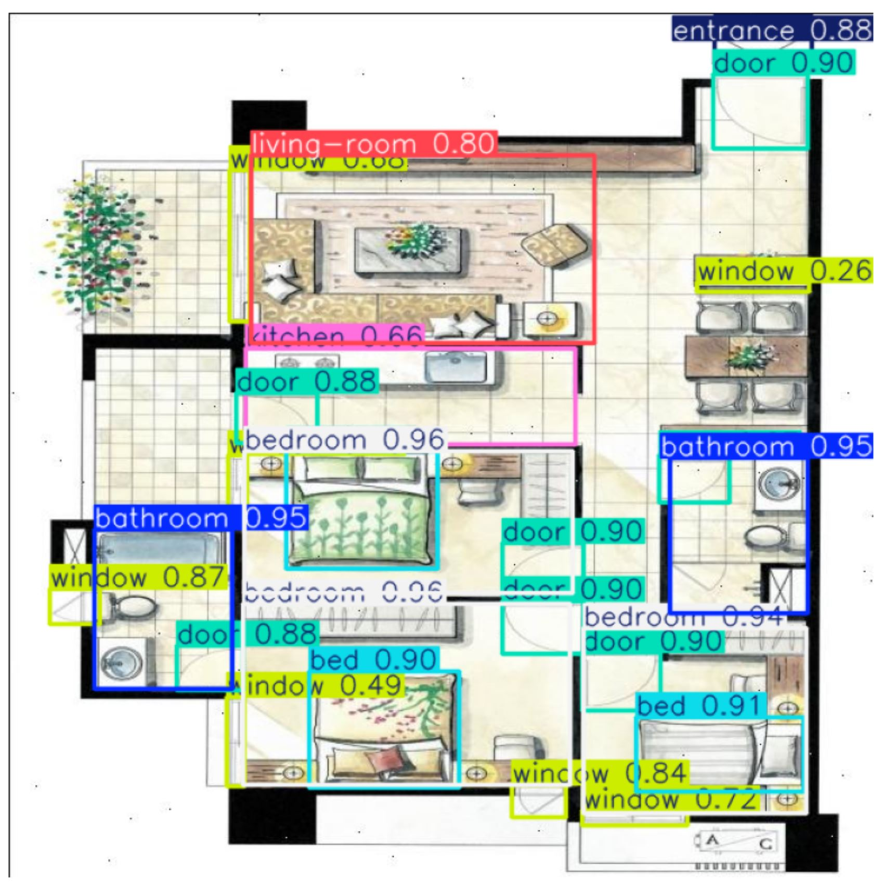

## **Object Detection Task:** 
Object Detection is a fundamental challenge in Computer Vision that extends beyond simple image classification. While image classification determines what is present in an image (e.g., "this is a kitchen"), Object Detection answers both **"what"** and **"where"** by identifying multiple objects or regions within an image, assigning them to predefined categories, and locating them using bounding boxes.

## Traditional Object Detection
Classical object detection was dominated by the **R-CNN family of models**, which followed a multi-stage detection approach. **R-CNN (Region-based Convolutional Neural Network)** first generated thousands of candidate object regions using a selective search algorithm and then applied a CNN to classify each region individually. Although R-CNN achieved significant improvements in detection accuracy, it was computationally expensive and slow because each region had to be processed separately. In R-CNN, **Non-Maximum Suppression (NMS)**, was introduced to remove duplicate/overlapping detections by keeping only the highest-confidence box in each region. 

To address these limitations, **Fast R-CNN** was introduced. Instead of running the CNN on every proposed region, Fast R-CNN processed the entire image only once to generate a feature map, from which region features were extracted and classified. This greatly improved training and inference speed while maintaining high accuracy. However, it still relied on the slow selective search algorithm to generate region proposals.

The next advancement, **Faster R-CNN**, replaced selective search with a learnable **Region Proposal Network (RPN)** integrated directly into the neural network. The RPN generated candidate object regions much more efficiently, enabling near real-time performance while further improving accuracy. Faster R-CNN became the standard two-stage object detection framework and laid the foundation for many modern detection architectures before the emergence of one-stage detectors such as YOLO.

## The **YOLO**: (You Only Look Once)

YOLO changed the classical "multi-stage" object detection process by detecting and classifying objects in **one step**. Instead of examining different regions separately, YOLO processes the entire image at once and predicts object locations and categories simultaneously. This makes object detection much faster while maintaining high accuracy, enabling real-time applications such as self-driving cars, security cameras.

### 3 most recent YOLO Versions used in this study:

| Feature | YOLOv11 | YOLOv12 | YOLOv26 |
|----------|---------|---------|----------|
| Architecture | Modern one-stage detector with efficient feature aggregation | Enhanced architecture with Area Attention and R-ELAN (Residual Efficient Layer Aggregation Network) | End-to-end, NMS-free object detector |
| Main Innovation | Optimized for computational efficiency and speed | Attention-based feature learning for crowded and overlapping objects | Eliminates Non-Maximum Suppression (NMS) post-processing |
| Detection Strategy | Traditional one-stage detection | One-stage detection with advanced attention mechanisms | End-to-end detection producing final predictions directly |
| Strength | Fastest inference performance | Highest detection accuracy | Reduced post-processing overhead and improved deployment efficiency |
| Special Capability | High-speed real-time inference | Better focus on overlapping vehicles in dense traffic scenes | Removes NMS bottleneck, making it suitable for edge hardware |
| Trade-Off | Prioritizes speed over maximum accuracy | Higher accuracy at the cost of increased latency | Slightly lower accuracy than YOLOv12 but more efficient inference pipeline |
| Best Use Case | Real-time applications requiring minimal latency | Applications where detection accuracy is the primary objective | Edge and embedded deployments requiring streamlined inference |

## Floorplan dataset

Automated floor plan understanding is a practical challenge in architecture, real estate, and smart building systems. Detecting rooms, fixtures, and openings accurately and quickly from 2-D raster floor plans requires a model that can handle highly structured, low-texture imagery — very different from the natural scenes most YOLO benchmarks use.

In this post I compare three state-of-the-art YOLO *extra-large* (x) variants — **YOLO11x**, **YOLOv12x**, and **YOLO26x** — trained on the same floor plan dataset with 8 classes:

| # | Class | Instances (val) |
|---|-------|-----------------|
| 0 | bathroom | 180 |
| 1 | bed | 279 |
| 2 | bedroom | 285 |
| 3 | door | 762 |
| 4 | entrance | 99 |
| 5 | kitchen | 99 |
| 6 | living-room | 99 |
| 7 | window | 558 |


The data can be downloaded from **roboflow**[https://universe.roboflow.com/simple-floor-plan/floor-plan-f2lla/dataset/7]

- The data is downloaded accordingly to YOLO format containing train and valid folder with images and corresponding labels in bounding box format:

```text
yolo_data/
├── data.yaml
├── train/
│   ├── images/
│   │   ├── image001.jpg
│   │   ├── image002.jpg
│   │   └── ...
│   └── labels/
│       ├── image001.txt
│       ├── image002.txt
│       └── ...
├── valid/
│   ├── images/
│   │   ├── image101.jpg
│   │   ├── image102.jpg
│   │   └── ...
│   └── labels/
│       ├── image101.txt
│       ├── image102.txt
│       └── ...
```



## YOLO Model training and validation
#### Model download
- Here we download yolo v11, v12 and 2026 extra large model to our system:

```
https://github.com/ultralytics/assets/releases/download/v8.4.0/yolo11x.pt
https://github.com/ultralytics/assets/releases/download/v8.4.0/yolo12x.pt
https://github.com/ultralytics/assets/releases/download/v8.4.0/yolo26x.pt
```

#### Model training
- We create a conda environment, then install latest ultralytics package.

```
pip install -U ultralytics
```

We train model using train data via CLI in separate folder:

```
yolo detect train data=data.yaml model=yolo11x.pt epochs=100 imgsz=640 > train_v11.log
yolo detect train data=data.yaml model=yolo12x.pt epochs=100 imgsz=640 > train_v11.log
yolo detect train data=data.yaml model=yolo26x.pt epochs=100 imgsz=640 > train_v26.log
```

- In the above CLI command, we train each model with 100 epochs, the image resolution is rescaled to 640 and save the output to a log file
- The corresponding output "weight": **last.pt, best.pt** from the train model are store in corresponding folder:

```
runs/detect/train/weight/last.pt
runs/detect/train/weight/best.pt
```

#### Model validation
Validate the model on valid data set using the same test set on 3 models in separate folder:

```
yolo val model=./runs/detect/train/weights/best.pt data=data.yaml > val_v11.log
yolo val model=./runs/detect/train/weights/best.pt data=data.yaml > val_v12.log
yolo val model=./runs/detect/train/weights/best.pt data=data.yaml > val_v26.log
```

## Training Session Comparison (100 Epochs)

All three models were trained for **100 epochs** on the same floor plan dataset with identical hyperparameters. Below is a direct comparison of training speed and final convergence metrics.

#### Training Setup
| Parameter | Value |
|---|---|
| **Epochs** | 100 |
| **Batch Size** | 16 |
| **Optimizer** | AdamW (auto-tuned) |
| **Image Size** | 640×640 |
| **Augmentation** | RandAugment, mosaic, mixup disabled |
| **Hardware** | NVIDIA A100-SXM4-80GB |

#### Training Speed (per-image average, epoch 100)

| Phase | YOLO11x | YOLOv12x | YOLO26x |
|---|---|---|---|
| **Layers** | **191** | **283** | **190** |
| **100 Epochs** | **8 mins** | **12.2 mins** | **9 mins** |

#### Overall Validation Metrics

| Model | Precision (P) | Recall (R) | mAP@50 | mAP@50-95 |
|---|---|---|---|---|
| **YOLO11x** | **0.976** | **0.934** | **0.981** | **0.767** |
| YOLOv12x | 0.966 | 0.922 | 0.958 | 0.753 |
| YOLO26x | 0.966 | 0.890 | 0.937 | 0.742 |

#### Headline findings

1. **YOLO11x leads on every headline metric.** It achieves the highest precision (+1.0 pp over the others), recall (+1.2–4.4 pp), mAP@50 (+2.3–4.4 pp), and mAP@50-95 (+1.4–2.5 pp).
2. **YOLOv12x is a close second** in both mAP figures, but its substantially higher architecture complexity does not translate into a performance gain on this domain.
3. **YOLO26x trails the most on recall (0.890)**, suggesting it misses more objects overall — particularly in low-instance classes — despite being the smallest model.
4. The gap in **mAP@50-95** (strict IoU) is more pronounced than at mAP@50, indicating that localisation precision (tight box fitting) differentiates the models more than simple detection presence.

> **Verdict:** For floor plan detection, YOLO11x delivers the best accuracy while using fewer parameters than YOLOv12x.


## Inference Speed Breakdown

All times are **per-image averages** on the A100.

| Phase | YOLO11x | YOLOv12x | YOLO26x |
|---|---|---|---|
| Preprocess | 1.5 ms | 1.3 ms | 1.3 ms |
| **Inference** | **5.9 ms** | 10.2 ms | 17.2 ms |
| Loss | 0.2 ms | 0.2 ms | 0.2 ms |
| Postprocess | 14.3 ms | 12.2 ms | **1.2 ms** |
| **Total (approx.)** | **~21.9 ms** | ~23.9 ms | **~19.9 ms** |

### Speed analysis

- **YOLO11x has the fastest raw inference** at 5.9 ms — 1.7× faster than YOLOv12x and nearly 3× faster than YOLO26x. On latency-sensitive pipelines (e.g., streaming building inspection cameras), this matters.
- **YOLO26x has the slowest inference** (17.2 ms) but a remarkably fast postprocess step (1.2 ms vs 14.3 ms for YOLO11x). This suggests YOLO26x's architecture produces sparser, cleaner prediction maps that require minimal NMS filtering — an interesting design trade-off.
- **YOLOv12x occupies the middle ground** on inference (10.2 ms) but its larger postprocess overhead brings its total time above both competitors.
- In terms of **total end-to-end latency**, YOLO26x is marginally fastest (~19.9 ms) due to its near-zero postprocess cost, but this advantage vanishes if inference alone is the bottleneck (e.g., batch workloads).

**Note on postprocessing:** The postprocess phase includes **Non-Maximum Suppression (NMS)**, which removes duplicate/overlapping detections by keeping only the highest-confidence box in each region. Denser prediction maps (YOLO11x, YOLOv12x) require more filtering passes, while YOLO26x's sparser output naturally needs fewer NMS iterations. This is a key architectural trade-off between inference speed and postprocess efficiency.

## Per-Class Performance Deep Dive

### mAP@50 per class

| Class | YOLO11x | YOLOv12x | YOLO26x | Best |
|---|---|---|---|---|
| bathroom | 0.994 | **0.994** | 0.993 | Tied |
| bed | 0.977 | 0.977 | **0.980** | YOLO26x |
| bedroom | **0.995** | **0.995** | **0.995** | Tied |
| door | 0.991 | 0.991 | **0.992** | YOLO26x |
| **entrance** | **0.966** | 0.786 | 0.687 | YOLO11x |
| kitchen | **0.965** | 0.963 | 0.933 | YOLO11x |
| living-room | **0.995** | **0.995** | 0.960 | Tied / YOLO11x |
| window | **0.968** | 0.967 | 0.957 | YOLO11x |

### mAP@50-95 per class (localisation quality)

| Class | YOLO11x | YOLOv12x | YOLO26x | Best |
|---|---|---|---|---|
| bathroom | 0.906 | **0.924** | 0.911 | YOLOv12x |
| bed | 0.869 | 0.872 | **0.885** | YOLO26x |
| bedroom | **0.931** | 0.930 | 0.914 | YOLO11x |
| door | **0.761** | 0.749 | 0.753 | YOLO11x |
| **entrance** | **0.625** | 0.533 | 0.497 | YOLO11x |
| kitchen | 0.731 | **0.747** | 0.718 | YOLOv12x |
| living-room | **0.789** | 0.758 | 0.727 | YOLO11x |
| window | 0.521 | 0.514 | **0.532** | YOLO26x |

### Class-level insights

#### 🏠 Easy Classes — Bedroom, Bathroom, Bed, Door
All three models perform near-identically on these high-instance, visually consistent classes (mAP@50 ≥ 0.977). The large number of training samples and distinctive geometric signatures (rectangular rooms, rectangular doors) make them trivially learnable at IoU=0.50.

At strict IoU (mAP@50-95), **bathroom** is the one exception: YOLOv12x leads at 0.924 vs YOLO11x's 0.906, possibly because its attention mechanism better localises bathroom walls and fixtures that partially overlap with other rooms.

#### 🚪 Entrance — The Hardest Class
Entrance is the most challenging class across all models, with only 99 instances and high visual ambiguity (entrances can look like doors or open gaps). 

- YOLO11x: mAP@50 = **0.966** — excellent despite the challenge
- YOLOv12x: mAP@50 = **0.786** — significant drop (-18.0 pp)
- YOLO26x: mAP@50 = **0.687** — the worst result in the entire benchmark (-27.9 pp vs YOLO11x)

The v11 architecture's clear superiority here suggests it has better feature representation for this ambiguous, low-frequency class. The recall figures tell the story: YOLO11x achieves 0.773 recall on entrance, while v12 and v2026 drop to 0.636 and 0.626 respectively — both models miss roughly 37% of entrances.

#### 🍳 Kitchen — Moderate Challenge
Kitchen has 99 instances and scores well on YOLO11x (mAP@50 = 0.965) but drops to 0.933 on YOLO26x — a 3.2 pp degradation. YOLOv12x is competitive at 0.963. Kitchen geometry varies (L-shaped, galley, open-plan), making it harder for models with weaker contextual reasoning.

#### 🪟 Window — Lowest mAP@50-95
Windows consistently have the lowest mAP@50-95 across all models (~0.51–0.53). This is expected: windows appear as thin wall breaks or small rectangles whose bounding boxes are intrinsically harder to tighten at IoU > 0.7. YOLO26x marginally leads at 0.532 on strict IoU, while YOLO11x leads at mAP@50 (0.968).


## Recall vs Precision Trade-off

| Model | P | R | P–R Gap |
|---|---|---|---|
| YOLO11x | 0.976 | 0.934 | 0.042 |
| YOLOv12x | 0.966 | 0.922 | 0.044 |
| YOLO26x | 0.966 | 0.890 | 0.076 |

YOLO26x has the widest precision–recall gap (0.076), meaning it sacrifices the most recall to maintain precision. In practice, missing more objects (lower recall) is often worse than a few false positives in floor plan analysis, where completeness of detection is critical for downstream tasks like area calculation or BIM integration.


## Summary Scorecard

| Metric | Winner |
|---|---|
| Overall mAP@50 | 🥇 YOLO11x |
| Overall mAP@50-95 | 🥇 YOLO11x |
| Overall Precision | 🥇 YOLO11x |
| Overall Recall | 🥇 YOLO11x |
| Fastest Inference | 🥇 YOLO11x (5.9 ms) |
| Fastest Total Pipeline | 🥇 YOLO26x (~19.9 ms) |
| Bathroom mAP@50-95 | 🥇 YOLOv12x |
| Bed mAP@50-95 | 🥇 YOLO26x |
| Smallest Model | 🥇 YOLO26x (55.64 M params) |
| Hardest Class (Entrance) | 🥇 YOLO11x (by a large margin) |


## Practical Recommendations

| Use Case | Recommended Model | Reason |
|---|---|---|
| Production floor plan pipeline | **YOLO11x** | Best accuracy on all metrics, especially entrance/kitchen |
| Latency-critical edge deployment | **YOLO26x** | Lowest total pipeline time (~19.9 ms); smallest model |
| Bathroom-focused applications | **YOLOv12x** | Highest bathroom mAP@50-95 (0.924) |
| Research into dense detection | **YOLOv12x** | Attention backbone worth exploring with larger datasets |


## Limitations & Future Work

1. **Small validation set (102 images):** Statistical significance should be validated on a larger held-out set. The per-class differences for low-count classes (entrance, kitchen, living-room: 99 instances each) may not generalise.
2. **Single-resolution evaluation:** All models were evaluated at the same input resolution. Multi-scale testing (`augment=True`) could shift rankings, especially for windows and entrances.
3. **A100 hardware bias:** The postprocess cost advantage of YOLO26x may be less pronounced on lower-end hardware where NMS is GPU-accelerated less efficiently.
4. **Floor plan diversity:** The dataset covers simple schematic plans. Results on more complex, hand-drawn, or photo-realistic floor plans may differ.

##  Conclusion

On the **Simple Floor Plan** dataset, **YOLO11x is the clear winner** — it achieves the highest mAP@50 (0.981), mAP@50-95 (0.767), precision (0.976), and recall (0.934), and does so with the fastest inference (5.9 ms). The newer, heavier YOLOv12x architecture does not outperform it despite having 49% more layers and ~2 M more parameters, suggesting that the architectural changes in v12 are optimised for natural image detection rather than structured floor plan imagery. YOLO26x, positioned as the 2026 architecture, shows promise in pipeline efficiency and competitive per-box localisation on some classes, but its significant recall drop on entrance and kitchen classes is a concern for practical deployment.

For practitioners working on floor plan analysis, YOLO11x remains the safest choice today. Monitoring how YOLO26x evolves with fine-tuning and multi-scale inference will be a worthwhile experiment.

*Benchmarks run on NVIDIA A100-SXM4-80GB · Ultralytics 8.4.64 · PyTorch 2.7.0+cu126 · Dataset: [Roboflow floor-plan-f2lla v7](https://universe.roboflow.com/simple-floor-plan/floor-plan-f2lla/dataset/7) (CC BY 4.0)*
